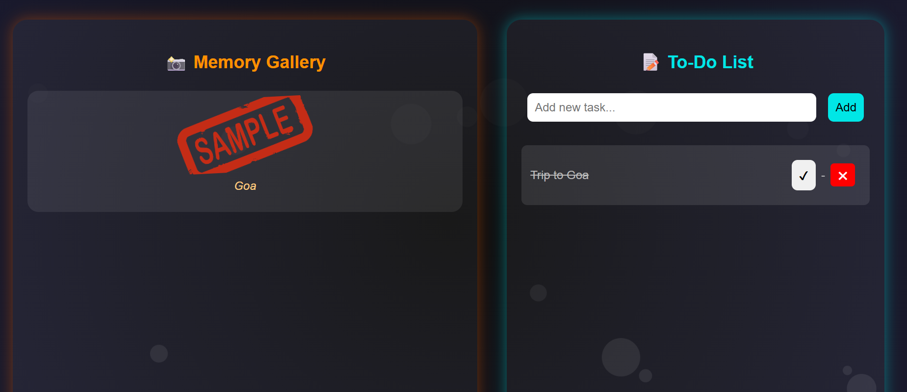

To-Do-Nest is a creative, interactive Halloween-themed To-Do List web app that makes productivity fun and spooky! 👻
It combines task management with personal memories, letting you not only track your tasks but also attach photos and memories to them in a visually rich, animated style.

When you complete or delete tasks, playful ghosts, pumpkins, and bubbles bring the interface to life. The app creates beautiful photo collages for each task—styled differently each time—to make your progress feel more personal and rewarding.

The interface features a dark Halloween atmosphere with a floating ghost that reacts to your actions. A task panel lets you add, mark, and delete tasks, while a photo section stores and displays your uploaded pictures in animated collage layouts.

🧩 Key Features:

🎃 Halloween Theme: immersive spooky design with ghost, spider webs, and pumpkins.

📸 Memory Collages: upload one or multiple pictures with a task; automatically displayed as unique collage styles.

🗂️ Task & Memory Sync: deleting a task also removes its associated photos.

✨ Bubble Effects: floating bubbles in the background for aesthetic ambience.

💾 Persistent Storage: tasks and images are saved locally so your data stays after refresh.

🕹️ Simple Controls: add tasks easily, delete with one click, and watch the ghost react.

🌑 Dark Mode Only: pure Halloween vibe—no light mode distractions!

⚙️ Tech Stack:

Frontend: HTML5, CSS3, JavaScript (Vanilla)

Storage: Browser LocalStorage for saving tasks and photos

Animation: CSS keyframes & JS DOM animation

Design: Responsive layout with split sections (tasks on right, photo memories on left)

🚀 How to Run:

Download or clone the repository:

git clone https://github.com/Nonsoul23/To-Do-Nest.git

Open the project folder and launch the index.html file in your browser.

Start adding tasks and uploading your spooky memories! 🕸️

Preview:

💡 Future Enhancements:

Add sound effects 

Add seasonal modes (Christmas, New Year themes)

Cloud storage for photo backups

User login for personal task collections

👨‍💻 Author:

https://github.com/Nonsoul23
A passionate web developer who loves to make everyday apps fun, interactive, and visually magical 👻
